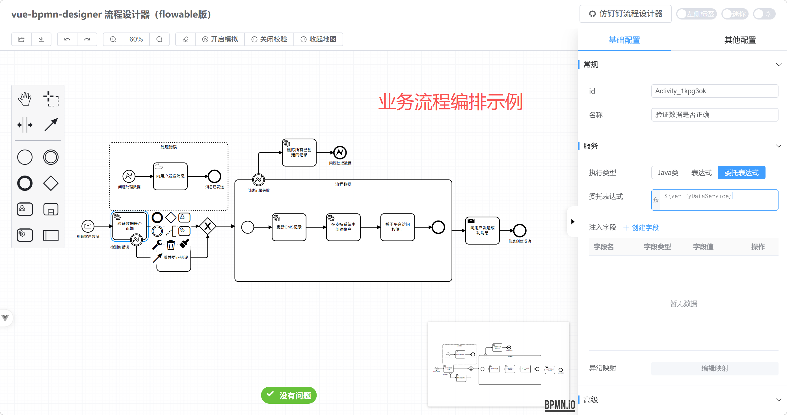
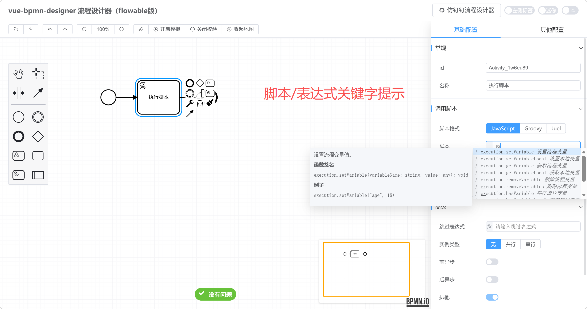
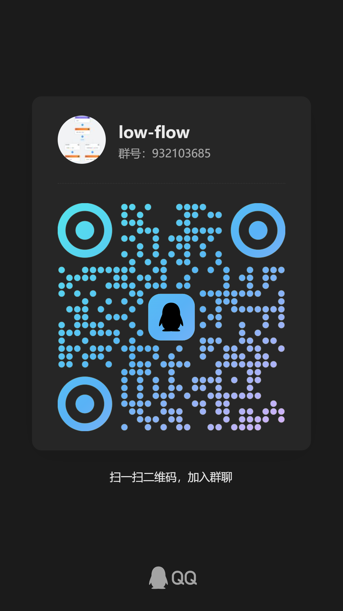

<div align="center">
    <h1>vue-bpmn-designer</h1>
    <p>BPMN process designer (Flowable edition)</p>
</div>

---
## Online Preview

- Preview URL: https://tsai996.github.io/vue-bpmn-designer/

Modern BPMN designer built with **Vue 3** + **Vite 6** + **TypeScript**.  
This project deeply integrates `bpmn-js` and provides Flowable-focused customization for diagram modeling, property editing, and BPMN lint validation out of the box.

## ✨ Features

- **⚡️ Modern Stack**: Vue 3 (Composition API), Vite 6, TypeScript
- **🎨 UI System**: Based on Element Plus and SCSS
- **⚙️ Deep Bpmn-js Integration**:
  - Built-in `bpmn-js` with Flowable syntax support
  - Real-time linting via `bpmn-js-bpmnlint`
  - Process simulation via `bpmn-js-token-simulation`
  - Extra plugins such as grid background and mini-map (`diagram-js-minimap`)
- **💻 Embedded Code Editor**: Built-in CodeMirror 6 for advanced script/config editing
- **🧩 Developer Experience**:
  - `unplugin-auto-import` + `unplugin-vue-components` for auto imports
  - ESLint + Prettier integrated

## Related Project

- If you are interested in a DingTalk-style flow designer: [lowflow-design](https://gitee.com/cai_xiao_feng/lowflow-design)

## 🖼️ Screenshots

<p>
  
  
</p>

## 📦 Installation

Use `pnpm` as package manager.

```bash
# clone repository
git clone https://github.com/tsai996/vue-bpmn-designer.git

# enter project
cd vue-bpmn-designer

# install dependencies
pnpm install
```

## 🚀 Scripts

```bash
# run dev server (port/options are in vite.config.ts)
pnpm dev

# build for development
pnpm build:dev

# build for testing
pnpm build:test

# build for production (with type checking)
pnpm build:prod
# or
pnpm build

# preview local build
pnpm preview

# type check
pnpm type-check

# lint and format
pnpm lint
pnpm format
```

## 🛠️ Project Structure

```text
├── public/                 # static assets
├── src/                    # source root
│   ├── assets/             # static resources (icons, styles)
│   ├── components/         # base and business components
│   ├── typings/            # TS type declarations and generated d.ts files
│   ├── App.vue             # root component
│   └── main.ts             # app entry
├── .env.*                  # multi-environment configs
├── AGENTS.md               # AI collaboration constraints
├── eslint.config.ts        # ESLint 9 config
├── vite.config.ts          # Vite config
└── package.json            # scripts and dependencies
```

## ⚠️ Important Notes

1. **Auto Imports**: This project uses `unplugin`-based auto import heavily. Do **not** manually import Vue core APIs (`ref`, `computed`, etc.) or Element Plus components.
2. **Bpmn-js Engine**: For BPMN model updates, always use command APIs such as `modeling.updateProperties`. Do **not** mutate DOM or business objects directly, otherwise Undo/Redo may break.
3. **AI Rules**: Check `AGENTS.md` for project-specific AI development constraints.

## Community

> Add WeChat (note: bpmn) and request a group invitation.

<p>
  
  
</p>

## Sponsorship

If this project helps you, sponsorship is welcome.

<p>
  
  
</p>

## 📄 License

[Apache-2.0 License](./LICENSE)
